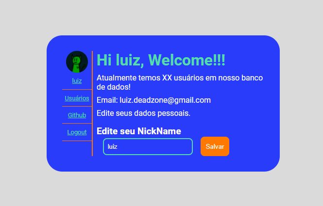

<h1 align="center">Login System</h1>

<p align="center">
   <a href="#Como-Inicializar">Como Inicializar</a>&nbsp;&nbsp;&nbsp;|&nbsp;&nbsp;&nbsp;
   <a href="#Tecnologias-Utilizadas">Tecnologias</a>&nbsp;&nbsp;&nbsp;|&nbsp;&nbsp;&nbsp;
   <a href="/LICENSE">Licença</a>
</p>

<a href="https://github.com/DinowSauron/Projeto-Next-Level-Week-6-Together" title="letmeask" >
    <p align="center">
        
    </p>
</a>


O Projeto se trata de um sistema de cadastro e listagem de usuários!

Neste projeto você pode criar uma conta e logar nela, após o login você será direcionado para uma página onde terá algumas informações sobre o seu login, e podera mudar seu nome caso necessário.
além disto também apos o login você terá acesso a página da listagem dos usuários, poderá ver suas fotos e emails... 

## Tecnologias Utilizadas:

* Express.
* Html, Css.
* Javascript.
* Dotenv.
* JWT.
* JSON (Database).


## Como Inicializar:

* ``yarn install`` - instala as dependências.
* Crie um arquivo com nome ``.env`` e coloque nele:
  ```.env
  PORT=3000 # server port

  JWT_PRIVATE_KEY="ChaveSuperSecreta" # recomended md5 key

  TOKEN_EXPIRES=500 # in seconds
  ```
* ``yarn dev`` - executa o projeto localmente
